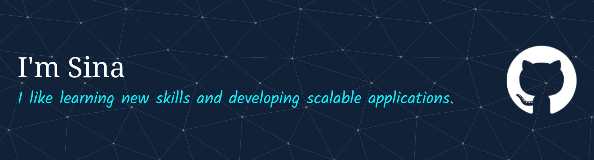

> I build scalable and maintainable web applications with a focus on performance, developer experience, and clean architecture. I'm currently deepening my expertise in backend systems, infrastructure, and DevOps to become a well-rounded full-stack engineer.

## Current Focus
- Building [Cockatiel Messenger](https://github.com/Cockatiel-labs/Cockatiel-Messenger) — a privacy-first open-source messaging platform focused on performance, security, and self-hosting
- Learning distributed systems, infrastructure, and modern DevOps practices
- Exploring Bun, Elysia, and high-performance backend architectures

## Tech Stack

